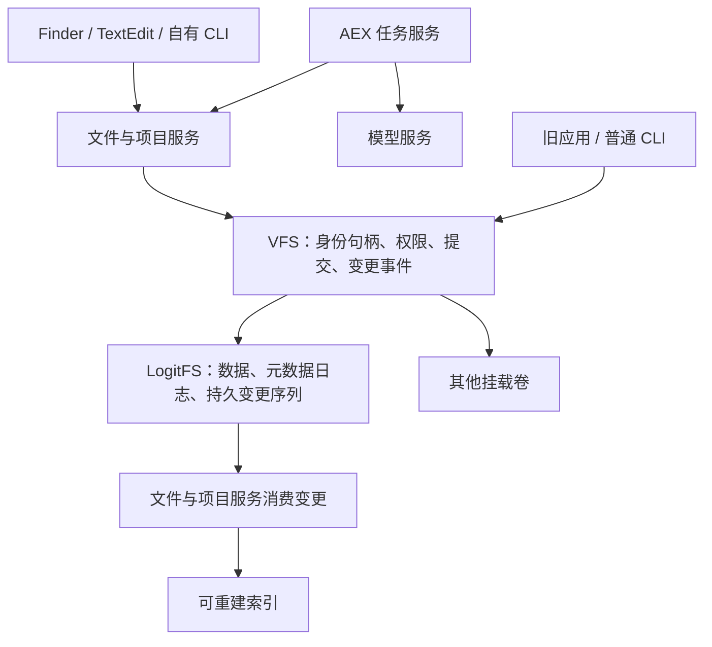
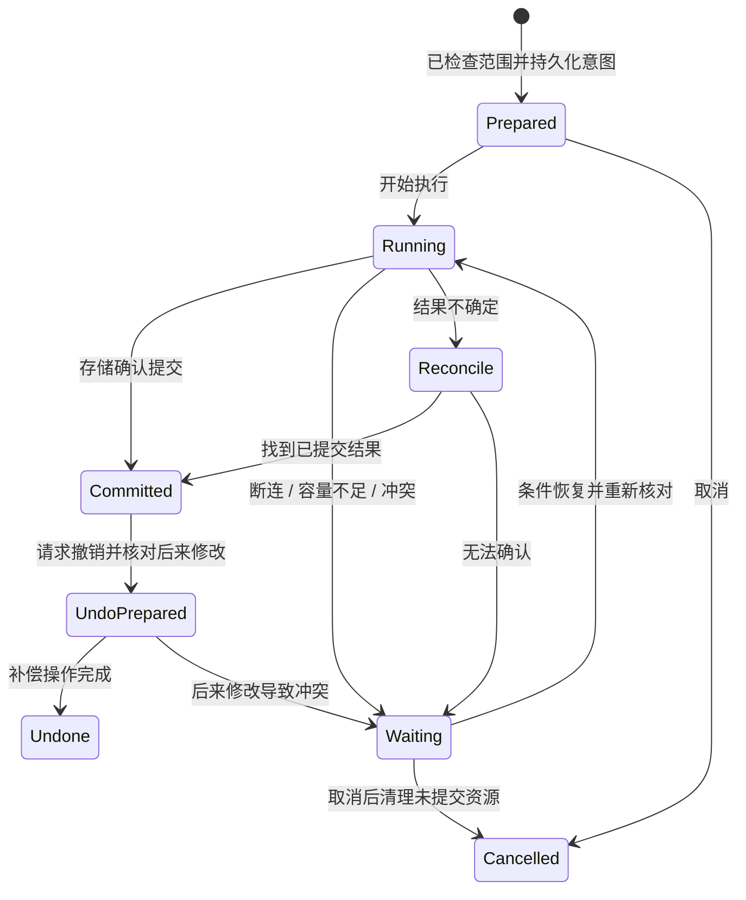

# LogitOS 文件管理：目录即 Project

日期：2026-09-13。状态：总体设计；首轮 Project 身份与应用联调已交付，范围见
[本轮实现与实测](PROJECT_WORKSPACE_2026-09-13.md)。

本文是目标协议和交付顺序，不能把全文视作已实现能力清单。本轮不移动
现有磁盘文件，不改变浏览器或第三方程序，也不升级磁盘格式。原生 TextEdit
已经实现的文档工作侧栏见 [现有交付](TEXTEDIT_WORKSPACE_2026-09-13.md)。

## 1. 产品契约

用户拥有文件；应用负责处理文件；系统保存文件身份、版本、授权和操作结果。
每个面向用户的目录就是一个 Project。目录树就是 Project 树；Project 同时承担
实际文件组织、工作上下文和持续任务的容器，路径表达其位置。

**2026-09-13 用户修正：**初稿提出“项目引用文件，真实文件夹另行组织”。用户
明确要求“一个文件夹它被叫做 project”。本版采用目录与 Project 一一对应，
撤销独立于目录树的项目集合模型。外部资料仍可显式引用，但引用不表示文件归属。

- Finder 默认打开 Project 首页；目录导航就是 Project 导航，不设置另一套
  需要用户在“项目”和“文件夹”之间切换的结构。
- 普通文件放在其父 Project 中，子目录就是子 Project。文本、图片等仍是普通
  文件；终端、旧应用和导出流程可以访问其当前内容。
- “移入 Project”实际移动文件；“复制到 Project”产生副本；“引用资料”创建
  明确的外部引用。一个文件只有一个直接归属（原生硬链接按后述多名字语义处理），
  可以被多个 Project 引用。
- 空目录也已经是 Project，不要求先填目标、建立任务或调用模型。工作能力在
  用户需要时展开，不能把一次新建目录变成表单流程。
- 应用关闭、升级和卸载不删除用户文档。窗口、任务、应用身份和文件身份各自有
  独立生命周期。
- 模型不可用时仍能打开、编辑、搜索已建的本地索引、移动文件和恢复已保留版本。
- 用户手动操作与应用代理使用相同的文件操作契约。材料中的文字不构成授权。

首条验收体验：建立“社区图书角”项目 → 引用四份资料 → 生成报告 → 审阅修改
→ 改名并移动报告 → 关闭应用和重启 → 在同一项目继续修改，来源仍指向原版本。

## 2. 当前源码中的基础与缺口

以下为 2026-09-13 的源码检查，不是本轮重新执行的运行验收。

| 部分 | 当前基础 | 本轮设计需要补齐 |
| --- | --- | --- |
| LogitFS | v4、元数据日志与有序数据写入、恢复、权限和时间戳、fsck | 可持续引用的身份、变更代数、可靠替换、实例化可写挂载、明确的容量演进 |
| VFS | 路径解析、权限、挂载、部分读取；后端主要按路径操作 | 以对象句柄操作、统一偏移写入/截断/同步语义、持久变更序列 |
| Finder | 目录、复制/剪切、改名、递归删除、向代理发布选区 | 项目首页、统一可恢复文件操作、回收站、冲突处理、分页与变更订阅 |
| AEX 任务 | 授权资料快照、操作回执、检查点、候选稿审阅 | 跨任务稳定文件关系、改名移动后继续、统一文档版本及产物归属 |
| 镜像更新 | 指定 preserve 根和保留式更新工具 | 安装内容与用户数据的统一归属清单，完整的迁移与回滚契约 |

具体入口：`c/fs/logitfs_fmt.h`、`c/fs/logitfs.c`、`c/fs/vfs.h`、
`c/apps/gui/files.c`、`c/lib/agent/task.h`、`c/apps/agent/agentd.c`、
`tools/mkfs.py`、`tools/disk_profile.py` 和 Makefile 的磁盘打包规则。

现有 LogitFS rename 在一个日志事务内重新连接目录项，但拒绝覆盖已存在的目标。
这可以作为同盘移动基础，不能把它当作已经具备原子替换。当前后端的 write
仍是整文件接口，不能仅在上层增加一个 pwrite 名称就宣称流式写入已经完成。

当前 Finder 的 N=64、PMAX=128 和 LogitFS 的 59 字节文件名限制均需单独治理；
只改变界面可输入长度会把错误延迟到保存。现有路径版 SDK 必须明确拒绝超限。

## 3. 目录与数据归属

路径为提案。磁盘真实名称固定，Finder 可显示本地化名称；更换界面语言不改路径。
账号名称只是展示/查找入口，权限归属仍使用系统用户身份。

```text
/
├── system/                         系统组件与共享资源，安装器管理
├── apps/<AppID>/<BuildID>/          登记的程序版本及其只读资源
├── home/<account>/
│   ├── Desktop/                    桌面
│   ├── Documents/                  独立文稿
│   ├── Downloads/                  下载；新内容可显示在“待整理”视图
│   ├── Pictures/ Music/ Movies/    用户媒体
│   ├── <自建 Project>/             与其他用户目录相同，可任意嵌套
│   └── Library/
│       ├── Applications/<AppID>/
│       │   ├── Data/               应用私有持久数据
│       │   ├── State/              可恢复工作与设置
│       │   └── Cache/              可重建数据
│       └── Logit/
│           ├── Catalog/            项目关系、用户标签与授权等主数据
│           ├── Versions/           已保留内容版本与固定来源
│           ├── Operations/         操作意图、完成回执与撤销信息
│           ├── Tasks/              已授权任务、检查点、候选稿
│           ├── Trash/              用户回收站记录
│           └── Index/              可重建全文/语义索引及缩略图
├── var/                            机器级服务状态
├── etc/                            机器配置与兼容接口
├── run/                            本次启动的通信端点和运行状态
├── tmp/                            有界临时空间
├── volumes/                        外部卷挂载位置
├── dev/ proc/                      内核提供的设备与进程视图
└── bin/ sbin/ usr/                  既有程序与开发工具兼容入口
```

`Library/Logit` 中的主数据、历史和派生索引必须分清。删除索引可重建搜索；删除
Catalog 会丢失用户关系与授权，不能称为“清理缓存”。私有系统管理的数据由服务
控制写入，不能因目录位于用户 home 就允许普通代理任意改写权限记录。

ProjectID 直接使用目录的稳定 FileID，不另外分配一套项目容器身份。它的普通
子项就是目录中的文件和子 Project；标题默认来自目录名，新产物默认写入当前
Project，用户也能选择其他已授权位置。Documents、Downloads 等是系统预建的
用户 Project，界面显示本地化名称；不设一个只有放进去才算 Project 的特殊目录。

Project 可引用外部位置的文件，但必须显示引用标记和来源位置。引用属于持久
元数据关系，不伪装成目录里的实体文件或 POSIX 软链接。移除引用不删原件。
删除 Project 先阻止作用于该子树的新任务提交，持久化任务暂停与删除意图，再
把真实目录子树移入回收站；存储提交也需核对 Project 状态，拒绝晚到的写入。
已经提交的结果进入同一回收范围；不删除引用的外部文件。恢复目录同时恢复它的
身份与工作关联，恢复任务由用户触发。

普通硬链接表示一个 FileID 在多个 Project 中有目录项，界面应承认这种多位置
语义，不能强行报告唯一父 Project。首版 Project 组织不主动创建硬链接；读到
既有链接时列出已知位置，并区分删除一个名字与删除最后一个名字。

应用通过 SDK 查询当前用户的标准目录，避免每个应用写死 `/docs`。程序版本目录
由登记系统选择，AppID 不等于可执行文件路径，也不接受消息自报身份。

### 迁移契约

1. 先生成旧盘清单：类型、内容校验、权限、所有者、时间戳、现有路径与归属。
   无法归属的文件保留原位，列入待处理；不能因“不在打包清单里”就删除。
2. 根据安装清单区分系统/应用文件与用户新建或修改的数据。同名冲突保留双方，
   给出明确恢复位置；迁移记录本身持久化。
3. 在独立镜像副本迁移，校验后才切换启动目标；保留原盘和版本化迁移报告。
   活跃 QEMU 使用的镜像不能被替换。
4. `/docs`、`/fonts`、旧根目录 AEX 等兼容路径在消费者迁移期间继续工作。
   不依赖当前仅在内存中的软链接记录完成长期兼容；实现持久映射或保留真实位置。
5. 浏览器目录和第三方资源按既有规则保留，不跟随本轮迁移改写。兼容映射也不能
   擅自改变浏览器当前看到的内容。
6. 更新安装内容与保留用户数据由一份可测试清单驱动。重建镜像、更新 AEX、
   升级系统都必须验证同一份保留规则。

## 4. 身份、版本与关系

### 4.1 文件身份

提议每个本地文件具有 FileID = VolumeID + 永不复用的对象序号；路径是查找该
对象的名字。VolumeID 持久保存，不能使用会在重启后变化的挂载号。inode 号可
复用，所以不能单独作为长期身份。删除对象后保留必要的墓碑记录，防止旧引用
误命中新文件。

| 操作 | 身份与关系规则 |
| --- | --- |
| 同盘改名/移动 | FileID 保持不变；更新名字/父目录与变更序列 |
| 修改当前文件 | FileID 保持不变；内容代数增加；保存的历史版本独立保留 |
| 复制/另存为 | 新 FileID；记录 derived-from，不继承原文件授权 |
| 跨盘移动 | 新卷上的 FileID；通过明确完成的移动回执更新项目绑定；保留迁移关系 |
| 外部程序用另一个文件替换路径 | 识别为新对象；已有任务等待核对，不能仅凭同路径自动换绑 |
| 移入回收站/恢复 | 原对象保留；恢复时检查同名占用，不覆盖后来创建的文件 |
| 永久删除后同名创建 | 新 FileID；旧引用显示已删除，不能指向新文件 |

跨盘移动的目标身份变化不能偷偷扩展授权。任务已固定的来源版本继续有效，后续
访问目标位置需核对移动回执、用户权限与原授权范围。无法写入稳定身份的外部
文件系统使用受管理导入或明确的外部引用；不得伪称拥有同样的保证。

复制整个磁盘会复制 VolumeID。克隆工具必须为独立可写副本重新标识并记录身份
映射；同时接入重复标识的卷时拒绝含糊的对象解析。备份恢复到原卷与创建独立
副本是两种操作。

### 4.2 三种引用

- 当前引用：FileID，解析该文件当前内容，适用于项目文件列表和普通打开。
- 固定引用：FileID + RevisionID + 内容校验，适用于资料依据、引用和历史审阅。
- 编辑草稿：DraftID + 基准 RevisionID + 草稿代数，适用于尚未保存的 TextEdit
  内容；持久化后才可作为后台任务输入。

固定引用必须能读取实际保留的字节，不能只记录一个版本数字再读取最新文件。
正文引用保存固定引用和片段字节范围，校验 UTF-8 边界；界面可以显示“来源 1”。
来源更新后提示可重新处理，旧报告仍指向旧来源。

内容代数记录文件提交过变更，保留版本记录可实际恢复的历史，两者不能混为一谈。
所有文件需要可靠身份和变更记录；默认仅对用户文稿、被引用来源和显式纳入管理
的产物保留内容历史，缓存、构建输出和临时文件不自动产生无限历史。

Project 的目标、外部引用、用户标签和授权是主数据，按目录 FileID 关联。空
Project 可以没有这些记录，目录内容与归属仍然完整。AI 标签和摘要注明来源与
生成时的版本，不自动覆盖用户标签。两个 Project 引用同一资料，不会因此共享
任务授权或领域记忆。

父子 Project 的包含关系来自真实目录树。子 Project 可有自己的目标；父目标
不会自动变成子任务。父任务是否可递归读取子 Project，以及是否覆盖以后新增
内容，必须由授权对象集合或明确目录授权定义；上下文继承不等于权限继承。
跨 Project 引用可以形成环，检索与上下文展开需按身份去重、限制范围和深度。

复制整个 Project 为新目录子树分配新身份；默认复制当前文件内容，工作历史和
任务不自动继续运行。“迁移 Project”和“复制 Project”使用不同操作回执。
复制后如需沿用引用或历史，需要显式复制策略并重新核对目标范围。

## 5. 存储与服务职责



内核负责对象与目录语义、权限、已打开对象生命周期、同步和提交顺序。用户态
服务负责项目、操作编排、版本保留、来源关系和可撤销策略。模型服务提供建议，
不能直接修改权限记录或绕过文件服务。

所有写入口最终经过 VFS，普通 CLI 改动也产生事件。旧的路径 API 解析成对象
句柄后再执行；路径检查之后又按字符串重新查找，会破坏并发下的对象绑定。
rename/unlink 后已打开描述符的生命周期须有明确契约，不能回退为“再次按旧路径
读取”。目录枚举采用稳定游标/代数，变化时可重试，不能把列表行号作为文件身份。

文件字节提交、内容代数以及供恢复使用的事件序号需要进入同一持久提交；索引器
异步处理事件并记录消费位置。事件发生丢失或日志裁剪时，返回需要重扫的状态。
重扫只重建派生数据，不能凭文件名推测已丢失的用户关系。

跨文件服务与 LogitFS 不假装拥有一个大事务：先持久化操作意图，再执行带操作
标识的存储提交，最后消费结果并保存回执。重启核对对象、版本和提交标识；无法
判断时进入待核对状态，不重复覆盖。项目元数据的结构版本不兼容时停止写入。

### 磁盘格式与 API 演进

持久身份、扩宽大小/名字、持久链接、变更序列的具体布局通过格式原型验证后再
确定。本轮已经用 LogitFS v5 交付持久 FileID、目录 ProjectID 和内容代数，
保留原 128 字节 inode 与 52 字节超级块前缀。它不包含下面的长名称、宽大小、
持久链接和通用版本事务。后续不兼容布局必须另升格式版本，不能重新解释已交付
的 v5；旧内核拒绝可写挂载 v5。

保留 v4 读取和迁移能力。新格式与现有日志恢复、fsck、mkfs、镜像快照工具、根盘
探测同步升级；不以格式号本身证明兼容。迁移不在用户正在使用的磁盘上就地试验。

地址/大小统一使用明确宽度，目标组件名 255 个 UTF-8 字节、路径 4096 个字节
（另保留 NUL），端到端审计实际消费者。扩宽 syscall、libc、SDK、Finder 和镜像
工具必须分阶段形成可运行闭环，旧接口超限返回错误而非截断。

提议服务契约如下，正式 ABI 尚未分配编号：

| 操作 | 必要输入 | 返回与约束 |
| --- | --- | --- |
| resolve | 用户凭据、路径 | FileID、当前代数、类型、卷能力 |
| open-version | 固定引用、任务授权 | 对应不可变字节，不能回退到最新版 |
| commit-document | FileID、预期代数、操作 ID、候选内容 | 比较并提交；冲突返回双方引用 |
| move / copy / trash | 来源身份、父目录身份、目标名、预期代数、操作 ID | 持久回执；能力不足明确返回 |
| restore / undo | 原回执、当前预期代数 | 核对后来变化后执行，不覆盖新数据 |
| project-reference | 目录 FileID、资料 FileID、关系类型 | 幂等添加显式引用，不改变目录归属 |
| subscribe | 事件游标、可访问范围 | 增量事件或明确重扫要求 |

## 6. 操作生命周期与恢复

操作 ID 在用户/服务命名空间内唯一；重复 ID 必须同时匹配原请求内容，复用 ID
发送另一项操作应被拒绝。权限每次执行时检查，目录授权绑定目录对象而不是一个
可被替换的路径前缀。



同盘元数据移动在存储事务内完成。跨盘移动依次进行目标暂存、复制、逐块校验、
同步、发布目标、持久化映射回执、回收源对象；发布目标前不能删除源。跨盘操作
可能短暂存在两份内容，界面显示真实阶段，不承诺跨卷原子性。

取消阻止后续提交；已经完成的提交提供明确结果和可用的撤销入口，不能把“取消
成功”解释成此前没有发生任何改动。批量操作保存逐项回执和汇总，支持部分完成，
不能把一半完成显示成全部成功。

复制保留内容完整性，权限按目标策略应用；硬链接、符号链接、循环目录、超大
文件、只读卷等必须有显式支持范围。不能沿用当前递归复制“忽略子项失败”式的
结果汇报。首版对不支持项逐个报告并保留来源。

回收站按卷保存被回收的对象及恢复记录，用户界面聚合展示；移除外置卷显示
离线。历史与回收站有容量预算，用户可查看占用。活动任务引用、未决操作和待
审阅稿固定的版本不能被自动清理。固定内容超出预算时停止新操作并保留进度，
不能静默删旧依据；引用计数和清理均须支持崩溃后核对。

## 7. Finder 与 AI 的交互

首页采用 Project 入口；侧栏保留最近、我的 Project、下载、回收站和磁盘位置。
进入 Project 直接看到其文件、子 Project 和明确标记的外部引用，右侧按需展开
当前目标与工作。选中文档后可切换到与 TextEdit 一致的文档工作侧栏，继续编辑、
查看版本或定位来源 Project。选中引用时，“移除引用”与“删除原文件”是两个
清楚的动作。

用户界面的“新建文件夹／打开文件夹／选择文件夹”改为“新建 Project／打开
Project／选择 Project”，不只更换列表图标。终端 mkdir、mv、cp、rm 的命令及
目录语义保持明确；mkdir 创建的目录自动出现在 Project 树，无需注册第二次。
系统维护目录在技术视图中保留真实路径，内核仍使用目录术语和结构。

搜索先完成本地名称、类型、时间和全文检索，结果带具体文件与匹配片段。语义
检索在本地候选和授权范围内补充；搜索结果和摘要遵守权限。Index 可增量更新、
暂停和重建，后台任务有内存/CPU/I/O 预算与空闲等待；不周期性全盘唤醒扫描。
本轮不引入系统内大模型。远程推理只接收本次授权的必要片段，经现有模型服务
完成，不因用户打开 Finder 就上传整个 home。

“整理这些资料”先解析为明确对象集合和操作范围。系统可以建议名称、项目关系、
目标位置、重复候选；执行由结构化动作承担。已授予范围内连续操作不逐项重复
请求授权。新范围、原本未授权的目标或有损冲突才需要用户选择。相同内容哈希可
提示重复，但不能据此合并身份、权限和历史，也不能自动删除副本。

未保存的编辑由 TextEdit 发布草稿快照，任务使用这份确定版本。候选稿与用户
继续输入并行存在；提交必须比较基准，冲突保留双方。文件服务保留产物版本，
任务服务保存任务状态与版本引用，避免两处各有一份“当前报告”主数据。

## 8. 交付顺序与验收

每个阶段均使用独立 BUILD 和私有磁盘副本；测试加入已有 tests/ 入口。格式、
权限、回执、版本负向控制是对应正向验收的前置依赖。

### A. 文件与目录基础

明确 namespace 清单、标准目录 SDK、身份与打开对象生命周期；完成新格式读写、
迁移原型和实例化挂载。补齐偏移写入、截断、替换、同步和变更事件契约。

验收：普通应用和 CLI 可读写；改名后已有描述符可用；同名重建不串对象；两个
可写卷隔离；长中文文件名端到端；断电逐点验证数据与身份一致；v4 迁移前后内容
和所有权一致；旧内核拒绝不理解的新可写格式。

### B. 可恢复文件操作与目录迁移

统一 Finder/自有 CLI 的操作服务、复制/移动/回收站/恢复、批量结果及用户数据
保留清单。先在副本上迁移并展示差异，再在安装入口采用同一规则。

验收：跨卷途中断电、目标满、目标重名、权限撤销、取消和重复请求；恢复不会
覆盖后来创建的文件；镜像重建前后所有未安装内容保留；被使用的镜像拒绝更新。

### C. 版本、项目与原生 Finder

Project 与真实目录一一对应，提供 Project 首页、子 Project、版本查看、来源
定位、冲突审阅和撤销。完善空 Project、无选区、大目录、外置卷离线、服务失败
时的行为。工作服务不可用时仍可浏览真实目录内容，不能显示伪造的空 Project。

验收：mkdir 创建目录立即成为 Project；嵌套、改名、移动、重启后目录与 Project
始终对应；显式多项目引用不产生副本；清空索引不丢用户标签和 Project 目标；
固定来源逐字节可读；历史预算不足时明确停止；旧应用替换路径被识别为新对象；
回收 Project 后任务停止新提交，恢复后身份不变；删除 Project 不删除外部引用。

### D. AEX 与真实 AI 闭环

Finder 向任务服务提供 FileID/RevisionID 授权集合；TextEdit 继续提交草稿和
候选修改；后台代理与文件服务使用统一回执；模型请求复用现有 DeepSeek 配置。

验收：真实模型完成资料到报告；报告改名、同盘和跨盘移动后继续修改；关闭窗口、
代理崩溃和系统重启后恢复；不同项目/用户之间不泄露内容；来源文本不能扩权；
延迟旧回复不能提交；资源记录覆盖版本占用、索引内存、空闲唤醒和模型请求数。

在阶段性门槛通过后跑 BIOS/UEFI × 512 MiB、2 GiB、8 GiB 回归，包括普通桌面、
旧应用、TextEdit/输入法及宽内存/ELF 装载既有入口。源码存在和宿主测试通过均
不能替代真实磁盘、重启和原生界面证据。

本版不同时建设分布式文件系统、云同步、自动全盘分类、全格式解析或系统内大
模型。后续磁盘布局扩展仍须先通过上述身份/替换/恢复验收，不能将 v5 身份验收
外推为所有文件管理功能的验收。

## 9. 本次设计交付

本文件锁定讨论用的规则、迁移边界和验收顺序。Finder 概念图在当前对话展示，
延续已选 TextEdit 的浅色原生样式。界面稿为产品设计，不是已经运行的 QEMU
截图。此次不把概念图中的状态当作功能完成证据。
