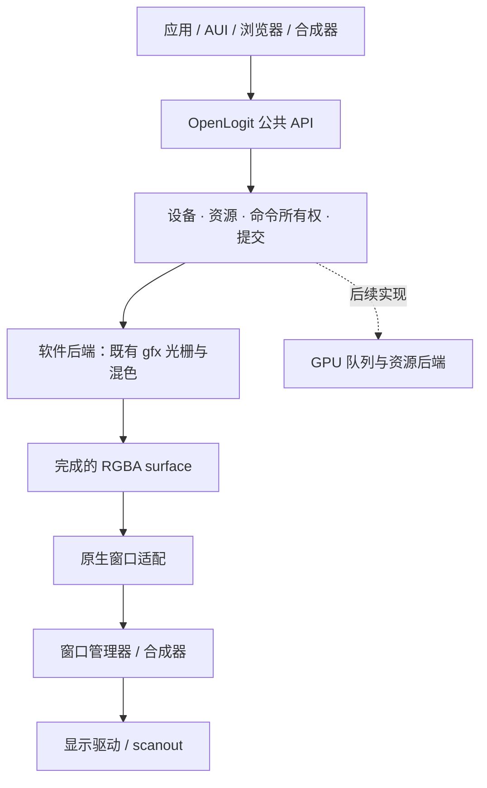

# OpenLogit 原生图形 API：第一轮重构与验收

> 2026-09-13 correction: this is the historical API 1.0 phase report. Its
> `build-openlogit-0913` artifacts subsequently disappeared. API 1.1, user-space
> software 3D and current evidence are tracked in [the implementation ledger](OPENLOGIT_SDK_IMPLEMENTATION.md).
> Historical measurements below are not current whole-system acceptance.


日期：2026-09-13。范围：`c/lib/gfx` 的运行时基础、原生窗口适配和 Clock 消费者。

OpenLogit 的产品定位是 **LogitOS 的系统图形 API**：应用通过它描述绘制、管理图形资源、查询能力和提交结果。它与 DirectX 在 Windows 上的关系相似，但不承诺 DirectX 二进制、着色器或源代码兼容。

这轮交付了可运行的 2D 软件设备基础。它还不是完整的 GPU/3D 图形栈，也没有完成全系统消费者迁移。

## 审查结果与处理

| 现有部分 | 实际情况 | 本轮处理 |
| --- | --- | --- |
| `gfx_path/math/raster/paint` | 已有路径、变换、覆盖率和混色算法，有独立数值参考测试 | 保留为软件绘制实现，复用同一个光栅器 |
| `gfx_stroke`、路径裁剪 | 已经有实现；`gfx.h` 开头还写着“phase 2 尚未开始” | 保留旧说明并在旁边加上带日期的更正 |
| 文字、SVG、AUI、浏览器 | 已经调用旧 `gfx_*` 接口；不是没有消费者 | 保留现有接线，避免重写算法时连带破坏字体和页面 |
| 系统级公共入口 | 缺少设备、资源生命周期、命令所有权、提交和版本协商 | 新增 `openlogit.h` / `openlogit.c` |
| 光栅器临时数据 | 进程内全局 edge/order/active/cross/row/acc 数组，不支持独立并发调用 | 提取每设备工作区；旧接口仍使用原来的串行工作区 |
| 绘制失败 | 单次 fill 的拒绝不能撤销同一帧此前成功的操作 | 增加独立 front/work 缓冲；整个命令列表成功才发布 front |
| 窗口显示 | 原始 blit 绘制不自动进入 AUI 的脏区域记录 | 窗口适配显式 composite；Clock 用 `aui_end_rect` 合并表盘区域 |
| Clock 放大与缩放 | 双圆边框实际最多 514 个点，旧容量只有 512 | 容量改为 1024，与真实表盘共用几何和容量测试 |
| 显示驱动 | 本轮检查的 Virtio GPU 路径负责显示和光标；NVIDIA 路径的启动 framebuffer 绑定不能证明硬件光栅化 | 当前设备只报告 software；请求 GPU 或 3D 会明确失败 |

## 层次和边界



图中的应用迁移是目标结构；本轮新入口的产品消费者是 Clock。其他消费者仍在 `gfx_*` 层，不能因为它们链接进了新对象文件就算迁移完成。

图形层不接管字体文件解析、图片解码、窗口焦点或输入路由。文字和图像库提供几何或像素资源；窗口管理器继续管理窗口和显示调度。这样绘制 API 才能服务应用与系统组件，而不把整个 GUI 混入一个库。

设备、命令提交和显示分别管理是参考关系，而不是照抄 COM。Microsoft 文档也分别描述了 [Direct3D 12 核心接口](https://learn.microsoft.com/en-us/windows/win32/direct3d12/direct3d-12-interfaces)、[命令列表与队列](https://learn.microsoft.com/en-us/windows/win32/direct3d12/design-philosophy-of-command-queues-and-command-lists) 和 [DXGI 显示接口](https://learn.microsoft.com/en-us/windows/win32/api/_direct3ddxgi/)。

## API 1.0 的契约

公共头：`c/lib/gfx/openlogit.h`。原生窗口适配：`c/apps/gui/openlogit_window.h`。

| 项目 | 当前契约 |
| --- | --- |
| API 版本 | `OL_API_VERSION = OL_VERSION(1, 0)`，创建时核对；当前仅接受 1.0 |
| 实现修订 | `ol_device_caps().implementation_revision = 1`，与 API 版本独立 |
| 后端 | `OL_BACKEND_SOFTWARE` |
| 能力 | 路径填充、矩形裁剪、渐变、图像、整列表提交失败时保留上一帧 |
| 格式 | `OL_FORMAT_RGBA8_STRAIGHT`；stride 是每行字节数，行尾 padding 不被改写 |
| 尺寸与容量 | 查询宽高、路径点数、活动边、采样数和命令存储上限；支持范围仍受调用者分配容量约束 |
| 对象 | opaque device / surface / list；调用者按查询结果分配并保持存储有效，8 字节对齐 |
| 几何所有权 | record 时复制点、子路径和 paint；之后重置或离开 builder 作用域不会改变已录制命令 |
| 图像所有权 | 命令保留 source surface 引用和 generation；有引用时不能销毁；录制后改动像素会使提交返回 stale resource |
| 提交失败 | 验证和绘制全部成功才复制到 front 并推进完成序号；不发布前半帧 |
| 并发 | 不同 device 有独立工作区；同一个可变对象要求单一所有者；设备正在提交时再次提交返回 busy |
| 显示 | `ol_window_composite` 写窗口 backing；`ol_window_present` 请求窗口 flush；AUI 消费者在合并其余控件后统一 end |

API 版本表达应用契约，修订号表达具体实现，capabilities 表达该设备能做什么。这三项不能用一个“OpenLogit 2/3”数字代替。未来新增 GPU 时仍须实际查询能力，不能把 OS 版本或驱动名称当作硬件绘制可用的证据。功能等级与硬件能力分开的参照见 [Microsoft feature levels](https://learn.microsoft.com/en-us/windows/win32/direct3d12/hardware-feature-levels)。

命令记录错误会锁存在列表中，`close` 和 `submit` 继续报错，直到显式 `reset`。这避免容量耗尽时录下半张图后仍报告成功。

这是进程内 C API。对象存储和像素分配必须互不别名，不能在尚有对象的内存上重新 create。裸指针对象不是跨进程句柄；未来内核/GPU transport 必须另做句柄和内存验证。所有像素修改通过 upload/submit，查看 front 时设备须空闲。

`OL_CAP_ATOMIC_FRAME` 只表示**整列表失败时不发布部分结果**，不表示 memcpy 对并发读者原子，也不表示整个桌面无撕裂。完成序号是同步软件执行序号，不是 GPU fence、垂直同步或“已经显示”的时间戳。

## 已接通的产品路径

Clock 启动时创建 device/list 并查询版本和能力。每次绘制把表盘或指针录成 clear/fill 命令，提交到 surface，再合成到窗口。窗口大小改变后重新创建匹配设备像素尺寸的 surface。

```text
创建 device → 查询 caps → 创建 front/work surface → 创建 list
reset → clear / fill / image → close → submit
取得完成的 surface → composite 到窗口 → 合并控件的脏区域 → present
销毁/重置持有图像引用的 list → 销毁 surface → 销毁 device
```

实际用法见 `c/apps/gui/clock.c` 的 `app_main`、`stamp` 和 `draw`。本轮每个 stamp 是一个事务；没有宣称 Clock 的全部控件已经合并成单个 GPU 命令帧。

代价也明确：每个 software device 保留一份光栅工作区，surface 用 front/work 两份像素存储；提交前后要复制像素。Clock 的像素工作缓冲为 384 × 384 × 4 字节，新增 589,824 字节。这是先确立生命周期和失败语义的实现，不是本轮的性能优化结论。路径容量从 512 增加到 1024 多用 4 KiB。

## 验收和可复核证据

隔离构建目录：`build-openlogit-0913`。

```sh
make -j6 BUILD=build-openlogit-0913 test-openlogit-os test-gfx test-mk-wired
```

该目标构建真实 ISO 和包含 Clock 的磁盘，启动 QEMU 客体并验证显示输出。只编译 kernel ISO 不足以验证本次应用修改。

- 新运行时：25 项主机检查，包含复制后的几何/paint、渐变和图像使用、引用保留、失效 generation、失败事务、行 stride/padding 和 4 个独立设备的 400 次并发绘制。
- 同一运行时测试另以 ASan/UBSan 编译运行，25 项通过，无 sanitizer 报告；这是这些测试输入的内存/算术检查，不是所有调用序列的证明。日志 `sanitized.log`。当前查询到 device 存储 202,776 字节、surface 对象 80 字节、最小 list 392 字节；应用应查询，不能硬编码这些实现值。
- 既有绘制精度：光栅 45、混色 21、描边 76、裁剪 25，共 167 项检查；与既有独立数值参考比较。
- 新负对照：关闭 commit 后出现 `FAIL ordinary frame commits`；恢复 Clock 旧的 512 点容量后出现 `FAIL Clock device geometry fits at every supported face radius`。两者都是正向目标的前置依赖。
- 既有负对照：禁用 AA、join 和 clip 的对应测试分别产生 68、28、9 项断言失败，正向实现通过。
- 客体显示：1280 × 800（100%）和 1920 × 1200（150%），每个模式检查表盘显示、秒针移动、真实窗口尺寸改变、resize 后重新显示，共 8 项。仅统计表盘内具有指针长度的蓝色连通区域，不能靠中心蓝点或错误文字通过。
- 测试接线：`test-mk-wired` 验证新 fragment 和 CI 入口可达。

最终结果以 `build-openlogit-0913/openlogit-guest/result.json` 的 `passed: true` **且** `complete: true` 为准；日志为 `acceptance.log`。该目录还保存 ISO/Clock 摘要、QEMU 参数、串口日志、各次屏幕截图和窗口尺寸。

第一次检查发现放大后的 Clock 出现 `invalid argument` 并丢失指针。实际双圆边框在半径 116 设备像素起达到 514 点，超出旧 512 容量。旧画面和初次验收结果保存在 `openlogit-guest-before-capacity`。修复后的 geometry gate 扫描半径 23–192，并与 Clock 共用 `clock_geometry.h`。

验收工具同时修正了两处误判：中心蓝点不能充当秒针；上一次尚未被 QEMU 截断的串口日志不能充当本次启动证据。脚本先清空自己拥有的日志，再等本次自动启动的 Finder，才为点击 Clock 标记事件起点。

## 后续按依赖推进

1. **完成 2D 公共契约。** 把 stroke、路径 clip、字体/图像资源通过同一资源与命令模型接入；明确变换、颜色空间、合成模式和 damage。先迁移 AUI/系统小应用，再迁移文字与浏览器，逐项保留精度和实屏对照。
2. **交付应用 SDK。** 当前新 API 由仓库 GUI 构建静态链接；还没有发布独立 sysroot 图形 SDK、稳定共享库 ABI 或 guest 编译示例。要把头文件、库、窗口入口、示例和真实 guest 编译/运行验收一起交付。
3. **建立显示与资源 transport。** 与内核/驱动明确资源句柄、内存映射和导入、队列完成、device lost、swapchain/resize、damage 与 present 同步；多窗口、多进程和失败恢复需客体验证。
4. **增加真正的 GPU 后端。** 同一场景通过软件和硬件后端对照；只有已实现并在设备执行的操作才能报告为 GPU 能力。Virtio scanout 和 boot framebuffer 不是这一阶段的替代品。
5. **扩展 3D。** 再定义 pipeline、shader、vertex/index buffer、texture/sampler、depth/stencil、render pass 与同步；先选真实 3D 消费者形成验收，再扩展接口覆盖。

旧 `gfx_*` 的全局缓存/串行调用约束仍然存在，不能由本轮“独立新设备并发”测试推导出整个旧图形栈线程安全。现有描边测试还明确记录 `gfx_path_rect` 的闭合语义缺口；新 API 本轮只录制 fill，没有借新增入口掩盖这个历史问题。
