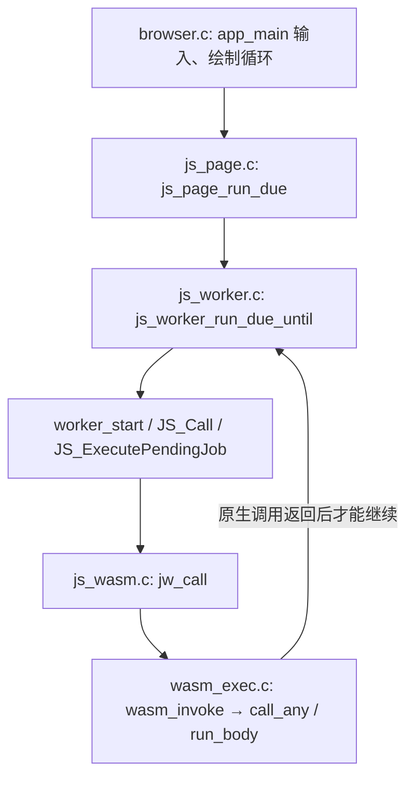
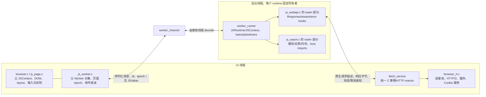

# 真正后台 Worker 的最小接入边界，2026-09-11

只读结论：可行，现有用户态 `pthread` 已具备独立用户栈和内核调度。推荐让整个 Worker 的 JSRuntime、任务循环和 Wasm 实例固定归属一个后台线程，再通过字节消息连接页面及统一的原生网络服务。当前代码不能直接把 `worker_start()` 放进 `pthread_create()`：它会在调用线程操作父页面的 QuickJS 对象，而且网络、注册表和关闭操作还依赖单线程串行执行。

本审查未修改生产源码、启动虚拟机或执行线程/内存故障测试；没有读取或运行站点脚本、Wasm 模块或算法。下文是接入设计，尚未实现或验收后台 Worker。

当前调用链全部处于浏览器 UI 线程的 C 调用栈：

8 ms 预算检查位于任务/reaction 的返回边界，不能暂停 F 内部的一次同步调用。`js_worker.c` 已给每个 Worker 创建独立 JSRuntime，却没有为它创建线程；`JSRuntime` 是堆和执行状态的隔离，不会自动获得独立调度。主页面的输入与绘制必须等这条调用链返回。

`jw_hostcall()` 又可从 Wasm 导入函数进入所属 Worker 的 `JS_Call()`。因此只把 `wasm_invoke()` 单独交给线程，会把本来固定的 JS 执行所有权拆开；最小合理移动单元是整个 Worker event loop。QuickJS 官方说明也要求一个 runtime 内部不并发执行，不同 runtime 之间不交换 JS 对象。[QuickJS C API](https://bellard.org/quickjs/quickjs.html#Runtime-and-contexts)

底座现状及可复用范围：

| 文件位置 | 当前可用能力 | 接入限制 |
|---|---|---|
| `c/apps/libc/src/pthread.c:343`；`c/apps/libc/include/pthread.h:136` | `pthread_create`，独立 mmap 栈、TCB，mutex/cond/futex | 创建和 JSRuntime 安装应在新线程执行；不在 UI 与 Worker 间迁移一个正在使用的 runtime |
| `c/kernel/sched/uthread.c:479`；`uthread.h:20` | 同进程/CR3 的独立线程及内核栈；调度状态独立 | 后台线程与 UI 仍共享进程内的原生全局数据 |
| `c/apps/libc/src/pthread.c:439` | join、detach 和资源回收 | join 会阻塞；detach 不会停止计算，UI 导航不能等待长调用的同步 join |
| `c/apps/libc/src/pthread.c:1190` | 当前 cancel/kill/setcancel 接口返回 ENOSYS，testcancel 为空 | 需要 Worker 自己的停止协议和运行时检查点；旧注释“内核没有 signals”已过时，不能用它描述整个内核 |
| `c/apps/libc/src/setjmp.asm:9`；`c/apps/libc/include/setjmp.h:4` | setjmp/longjmp 保存调用状态 | 未找到 ucontext/fiber 的独立栈创建、切换和生命周期 API；现成 fiber 不能直接使用。仅合作式 fiber 也不会让不主动让出的 native 调用自动返回 UI |
| `c/apps/libc/src/malloc.c:702`；`Makefile:967`、`:1152` | malloc/free/realloc/calloc 公开入口已加锁；浏览器实际链接 pthread 锁符号 | `js_worker.c` 旧注释把 malloc 概括为无锁共享已不准确；这不代表其他 libc 全局也完成了线程接入 |
| `c/apps/libc/src/io.c:23`；`c/apps/libc/include/errno.h:9` | 当前 errno 是进程全局变量 | 需要真正的每线程 errno，或同等正确的 libc ABI 接入 |
| `c/apps/libc/src/stdio.c:43`、`:55` | 标准 FILE 和 stream registry 为共享全局 | 当前未见这一路径的锁；Worker 日志宜发送记录给 UI 输出，其他会用共享 FILE 的入口须明确归属/保护 |
| `c/apps/libc/src/pthread.c:165`；`Makefile:1153` | pthread TCB/key 路径存在 | 当前 browser 链接未使用 `logit_tls.ld`；已有 browser.elf 的 TLS 边界符号为未定义弱符号，`tls_size()` 得到 0。不能简单把浏览器静态变量改为 `__thread` 就宣布隔离完成 |
| `include/abi/logit_abi.h:2635`；`c/apps/libc/src/poll.c` | eventfd、poll、cond/futex 可以唤醒等待线程 | UI 当前用 `SYS_WAIT_EVENT` 等窗口事件，写 eventfd 不会自动唤醒这个不同的等待源 |

默认线程栈是 8 MiB，需保留现有 Worker 的 2 MiB QuickJS 栈检查配置并在实际线程上初始化。线程表上限 64 不代表能创建 64 个浏览器 Worker；栈及其他映射还消耗 VMA。当前 `c/kernel/mm/virt/vma.h:44` 为 32 个区域，ABI 注释中旧的 16/约 13 线程估计已过时。保持现有最多 8 个 Worker 也仍需要普通资源容量验证，不能按表上限直接扩容。

建议的文件/所有权图（`worker_channel`、`worker_runner`、`fetch_service` 是拟新增模块名）：

首次实现可以让网络 reactor 继续归 UI 线程，通过现有非阻塞核心服务 Worker。这里是原生网络服务分层，不是由父页面 JavaScript 代调 fetch。Worker 的 Promise/Response/stream 只能在 Worker 线程创建、消费和释放；共享服务不持有或调用其 JSValue。

需要拆分或固定归属的具体位置：

| 当前文件与字段/函数 | 最小接入方式 |
|---|---|
| `js_worker.c:235` 的 registry、`:325` 的 tasks、watchdog/调度 cursor | UI 仅保留父代理和发布状态；每个 Worker 的任务、计时器、runtime 由该线程独占；队列交接用明确同步机制 |
| `js__wPostMessage():685`；`js__workerPostToWorker():1211` | 当前发送方会立即 `JS_ReadObject`、读取接收方对象并创建其 JSValue。改为发送方只 serialize，接收方在自己的线程 decode、取回调并递送 |
| `js_webapi.c:317` 的 `fetch_realm` | JS hooks/timers 和 base/origin/site 留在 Worker owner；借用指针不能跨线程，提交请求时复制元数据 |
| `js_webapi.c:876` 的 `g_fetch`、`:738` 的 preflight cache、`:512` 的 Cookie jar/store、realm/blob 计数器 | native 网络状态移到串行服务；JS resolver/stream state 留 realm。profile Cookie 仍共用一个权威存储，不能按线程复制成彼此不一致的 Cookie jar |
| `browser_rt.c:270` 的 request/pool；`:1713` prefetch cache；`:1908` HTTP/2 session/binding | 保持一个串行 reactor 所有者；所有调用都经原生命令队列，避免用覆盖完整 JS/native 计算的大锁保护它们 |
| `js__wImportScripts():726`、`worker_start():972`；`browser_rt.c:1592` 的 `g_tick` | 启动资源与 importScripts 走服务的非阻塞下载。Worker 可等待自己的结果通知；不能从后台调用 `bfetch_sync()` 的 UI `load_tick()`，它会轮询窗口、绘制并处理页面关闭 |
| `js_wasm.c:205` 的 `jw_realm`、`:217` 全局 registry/count | 每个 realm 的实例、活动导入调用栈和资源归其线程。registry 改为 owner 句柄或短临界区；不让 UI reset 正在执行的 Worker 实例 |
| `js_url.c:1858` 的 ClassID；`js_wasm.c:223` 的 ClassID；`quickjs.c:3476` | QuickJS 的 ClassID 分配是进程级。`LOGIT_OS` 当前关闭 `CONFIG_ATOMICS`，其 class 分配 mutex 也未编入。单独同步初始化/分配，或先完整预注册再启动线程；不应为此顺手开放 Web Atomics/SharedArrayBuffer |
| `js_page.c:1452`、`js_worker.c:422/1622` 的 teardown | 改为撤销页面 epoch、停止收件、发停止命令；Worker 自己清理其 JS/runtime，完成后发布 ack，UI 才回收控制块 |

消息描述至少携带页面 epoch、Worker generation、序列号、消息种类和自有字节长度。父 DOM 节点、父 JSContext/JSValue、当前 URL 的可变全局指针都不能进入 Worker payload。Blob 源码在创建时同步固定的现有语义可保留；跨线程移交自有副本，URL base 与 creator origin/site 仍分开。HTTP/CORS/credentials/redirect 规则继续由现有权威策略处理，响应字节队列必须有背压，避免后台计算期间持续累积网络正文。

UI 等待也要接通：最小第一版可让原 `js_worker_pending/next_due` 只读取发布的 mailbox/active 状态，在后台任务活动时沿用当前 `BROWSER_PUMP_MS=10` 的有界等待。它不得跨线程检查 Worker 的 `JS_IsJobPending()`。之后可把窗口事件与 eventfd 合并等待，消除周期轮询；当前 eventfd API 的存在本身还不等于已接入窗口等待。

取消与导航的正确顺序：UI 先撤销 epoch 和收件资格，发送停止标志并唤醒 Worker/网络等待；网络服务按 owner 取消传输，旧 epoch 的迟到结果只丢弃。JS 执行通过该 Worker 的 interrupt handler 读取停止标志；纯 native Wasm 还需要一个仅检查取消的正常执行检查点，使其返回到自己线程的调用边界。同步 export 保持同步，不执行 UI、不改成 Promise、不移除现有检查。Worker 展开当前调用后，在所属线程按 fetch/timers、Wasm、JSContext、JSRuntime 的顺序清理并通知完成。UI 不能从另一个线程直接释放正在执行的 runtime，也不能在导航时同步 join 一段长计算。

现有取消接口不足以提供这部分语义。若没有 native 取消检查点，只能将停止请求挂起直到该调用自然返回；这可作为明确限制的有限计算原型，不能宣称完整 `terminate()` 已实现。[HTML Worker 处理与终止模型](https://html.spec.whatwg.org/multipage/workers.html#worker-processing-model)

工作量判断为 5 个可独立评审/验收的阶段：① browser 线程 ABI、TLS/errno、共享 class 初始化；② byte mailbox 与完整 Worker runner 所有权；③ 保留现有 fetch/importScripts 行为的 native reactor 分层；④ 取消/导航异步收口；⑤ 双 Worker 与 UI 的实际 guest 验证。仅有限算术的后台原型为中等改动；保留当前网络、Blob、Wasm、终止和导航行为的产品接入是较大改动，粗估熟悉仓库的单人 1–3 周工程量，尚无实施测量，不能据此承诺交付日期。

后续验证应只使用自制有限功能：父页面真实输入/重绘在 Worker 算术尚未返回时发生；两个独立 runtime 正常传回 42；本地双 origin fetch 的文本/ArrayBuffer、允许与拒绝的 CORS、重定向、背压与同步 importScripts；有限任务执行期间请求 terminate/导航，旧 epoch 无回调，线程最终正常退出；关闭并重开页面后数据归属正确。当前 59 项预算与 3/3 guest 对照可以防止回归，但它们证明的是任务返回后的公平性，不能替代这些后台执行证据。
